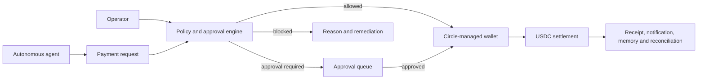
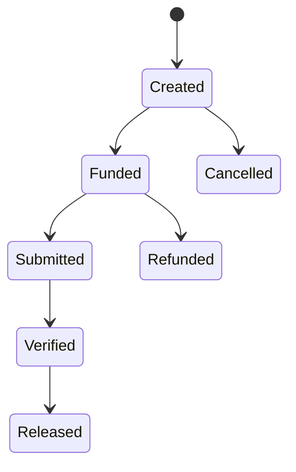
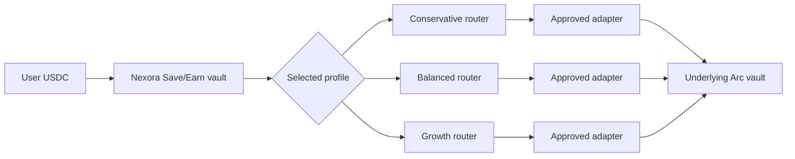
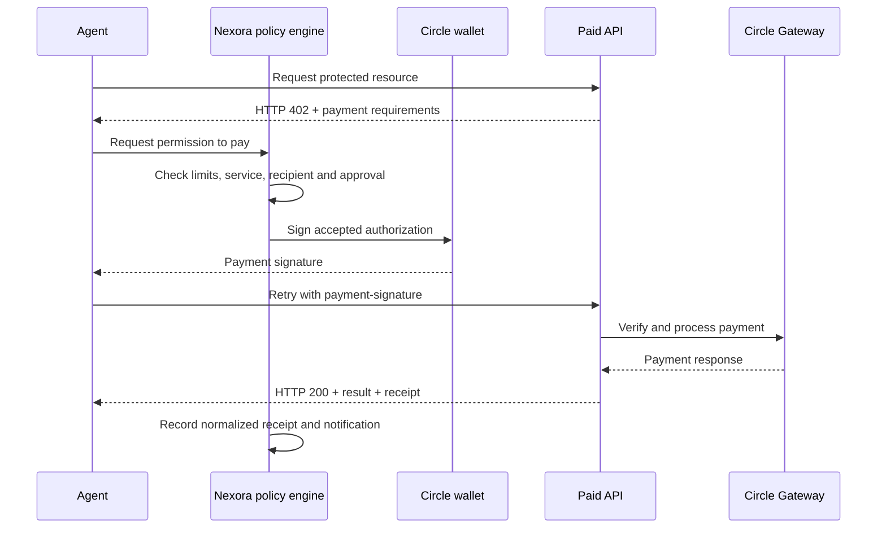
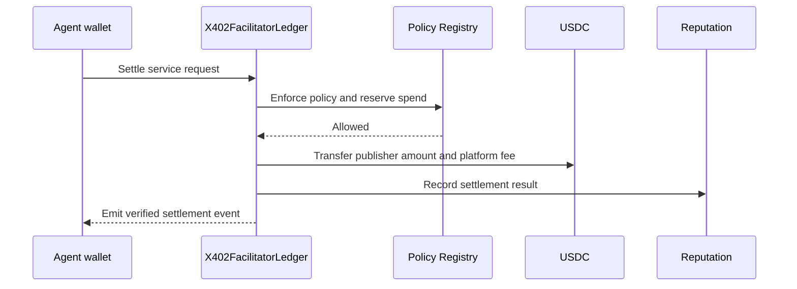
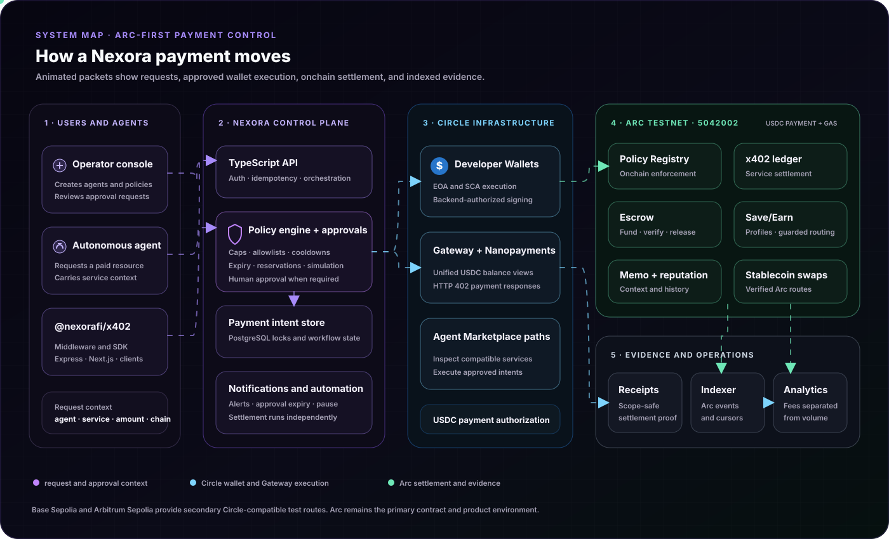

<!--
        ███╗   ██╗███████╗██╗  ██╗ ██████╗ ██████╗  █████╗
        ████╗  ██║██╔════╝╚██╗██╔╝██╔═══██╗██╔══██╗██╔══██╗
        ██╔██╗ ██║█████╗   ╚███╔╝ ██║   ██║██████╔╝███████║
        ██║╚██╗██║██╔══╝   ██╔██╗ ██║   ██║██╔══██╗██╔══██║
        ██║ ╚████║███████╗██╔╝ ██╗╚██████╔╝██║  ██║██║  ██║
        ╚═╝  ╚═══╝╚══════╝╚═╝  ╚═╝ ╚═════╝ ╚═╝  ╚═╝╚═╝  ╚═╝

        Arc-first controls and payment infrastructure for autonomous agents.
        Public product and integration details belong here.

-->

<div align="center">

<picture>
  <source media="(prefers-color-scheme: dark)" srcset=".github/assets/hero-dark.svg">
  <source media="(prefers-color-scheme: light)" srcset=".github/assets/hero-light.svg">
  
</picture>

<br/>

**[Live App](https://nexorafi.app)** ·
**[Docs and API](https://nexorafi.app/docs/api)** ·
**[Capabilities](#-capabilities)** ·
**[Payment Flows](#-payment-flows)** ·
**[Architecture](#-architecture)** ·
**[SDK Quickstart](#-sdk-quickstart)** ·
**[Built with Circle](#-built-with-circle)**

<br/>

[](https://testnet.arcscan.app)
[](https://www.circle.com/usdc)
[](https://www.x402.org)
[](https://www.npmjs.com/package/@nexorafi/x402)
[](./frontend)
[](./contracts)
[](./sdk/x402/LICENSE)

</div>

<br/>

> **Nexora is an Arc-first financial control layer for autonomous AI agents and USDC applications.** It gives developers managed wallets, programmable spending rules, x402 payments, paid-service infrastructure, receipts, escrow, notifications, treasury routing, and reconciliation in one stack.

Nexora plays a Stripe-like role for agent-facing SaaS and onchain applications: it supplies payment requirements, wallet execution, policy checks, approvals, settlement evidence, and developer APIs. Applications still own their user accounts, entitlements, refunds, tax handling, payouts, and internal ledger.

Arc is the primary environment. Nexora uses USDC for agent payments and Arc transaction fees, so an agent can operate with one accounting asset instead of maintaining a separate gas-token balance.


---

## ◈ Why Nexora exists

A wallet gives an agent signing authority. It does not give the operator financial control.

Teams still need to answer:

- How much can this agent spend per transaction, day, week, or month?
- Which services, recipients, and contracts can it pay?
- Which requests need human approval?
- Can concurrent requests exceed the same limit?
- Can an authorization or receipt be replayed?
- Can the operator prove what the agent purchased and why?
- What happens when payment succeeds but delivery fails?

Nexora places a policy and evidence layer around the payment lifecycle.



---

## ⬡ Capabilities

<div align="center">

| Control | Commerce | Treasury | Evidence |
|:--:|:--:|:--:|:--:|
| Agent wallets | x402 facilitator | Save/Earn profiles | Public receipts |
| Spending policies | Paid API marketplace | Arc stablecoin swaps | Structured memos |
| Approval queues | SDK and middleware | Circle Gateway views | Notifications |
| Risk simulation | Escrow workflows | Revenue accounting | Event indexing |

</div>

### 1. Agent wallets and identity

Nexora provisions and monitors Circle Developer-Controlled Wallets for autonomous agents.

```
wallet types       EOA · SCA
settlement modes   eoa_memo · sca_direct
primary network    Arc Testnet
identity           operator ownership · optional Arc name
authentication     wallet nonce signature · authenticated session
```

Nexora authorizes signing through Circle’s Developer-Controlled Wallet APIs. It stores Circle wallet identifiers and public addresses, not agent private keys.

### 2. Policy engine and approval workflow

Operators can configure:

- Per-transaction caps
- Daily, weekly, and monthly limits
- Recipient allowlists
- Contract allowlists
- Service allowlists
- Maximum units per request
- Cooldowns
- Policy expiry
- Required onchain policy
- Manual approval windows

The policy simulator explains which checks pass, which rule blocks a request, and what the operator can change.

Nexora serializes policy-sensitive payment sections per agent. PostgreSQL deployments use agent-scoped advisory locks and payment-intent row locks to reduce concurrent overspending.

### 3. Policy controls for Circle Agent Stack and Marketplace payments

Nexora can place compatible Circle Agent Stack and Agent Marketplace service payments inside its own application-control workflow.

Before a managed agent wallet pays, Nexora can:

1. Create an intent tied to the agent, operator, service, chain, and amount.
2. Apply transaction and period limits.
3. Check recipient and service allowlists.
4. Enforce cooldown and policy expiry.
5. Request operator approval.
6. Cap the authorized payment amount.
7. Prevent duplicate intent execution.
8. Verify submitted settlement evidence.
9. Store a normalized receipt and notify the operator.

External Circle Agent Stack applications can create an intent through the Nexora SDK, obtain approval, execute with their own Circle wallet, and submit the result for verification.

This workflow complements Circle’s wallet and marketplace controls. It does not modify Circle Agent Marketplace or replace wallet-level policies.

### 4. x402 facilitator and SDK

[`@nexorafi/x402`](https://www.npmjs.com/package/@nexorafi/x402) v0.4.0 provides:

- x402 v1 and v2 types and headers
- Express middleware
- Next.js route helpers
- Payment-requirement builders
- Verification and settlement clients
- EIP-3009 helpers
- Circle payment-intent helpers
- Receipt callbacks
- CAIP-2 network identifiers
- Permit2 helpers for optional non-EIP-3009 routes

Public facilitator surfaces include:

```text
GET  /api/x402/supported
POST /api/x402/verify
POST /api/x402/facilitator-settle
GET  /.well-known/x402
```

### 5. Paid-service marketplace

Nexora exposes six reference services through standard HTTP `402` payment flows:

| Service | Example use |
|---|---|
| Website Growth Analyzer | Review a public website and return structured findings |
| GitHub Repo Analyzer | Inspect repository quality and development signals |
| X Account Analyzer | Review public account positioning |
| Contract Safety Check | Run a structured contract-risk review |
| Landing Page Copy Reviewer | Review product messaging |
| Grant Application Reviewer | Review application clarity and completeness |

The Marketplace also supports verified independent publishers. Nexora checks the publisher, route, service identifier, endpoint, price, active state, and publication evidence before displaying an onchain service.

### 6. Receipts, memos, and agent memory

A normalized payment record can include:

```
agent and operator      service and publisher
gross amount            platform fee
publisher net amount    network and asset
request identifier      settlement evidence
status                  timestamp
```

Arc EOA settlements can include a structured `nexora.memo` record that binds the payment to its purpose, target contract, calldata hash, and budget context.

Memo privacy supports `public`, `selective`, and `private` scopes. Public receipt pages expose only scope-safe fields and never publish paid API output or escrow deliverables.

### 7. Escrow

Nexora Escrow supports USDC work agreements with deadlines, counterparties, performance bonds, deliverable evidence, and fee splitting.



Notifications can alert participants about funding, submission, verification, deadlines, release, and failure states.

### 8. Save/Earn treasury routing

Save/Earn separates deposits into three accounting profiles:

| Profile | Priority | Onchain maximum risk score |
|---|---|---:|
| Conservative | Liquidity and stability | `3500` |
| Balanced | Route performance, liquidity, and safety | `6500` |
| Growth | Reviewed higher-variance routes | `9000` |

A user selects a profile and deposits USDC once.



The selected Yield Router sends the deposit through an approved adapter into the active underlying Arc vault. Nexora retains accounting shares; the underlying route holds the deposited assets.

The optimizer reevaluates each configured profile every 24 hours. It considers route telemetry, liquidity, explicit risk metadata, minimum improvement, and migration cost. The onchain router rejects a destination above the profile risk ceiling and enforces the configured migration-loss limit.

The current Arc Testnet configuration exposes XyloNet as the only executable vault route. The optimizer stays in XyloNet until another reviewed adapter exposes complete, executable telemetry.

The optimizer is deterministic and telemetry-driven. Automatic execution remains opt-in.

### 9. Arc stablecoin swaps and Circle Gateway

The swap interface compares verified XyloNet and Synthra routes for supported Arc pairs:

```text
USDC ↔ EURC
USDC ↔ USYC
```

The user sees the selected venue, expected output, approval state, slippage controls, execution progress, and final transaction status.

Circle Gateway provides a separate unified USDC view across configured testnet domains. Operators can inspect domain balances, pending activity, fees, and deposit requirements from the console.

### 10. Notifications, automation, and analytics

Operators can bind delivery channels from the top of the Notifications page.

```
channels      in-app · email · Telegram · optional provider-gated channels
triggers      spend threshold · failed-payment burst · expiring approval
              policy expiry · large receipt · scheduled summary
actions       notify operator · pause configured automation
```

Notification mutations use a wallet-signed operator session. Email then uses a six-digit OTP before the address is linked. Verified email addresses and Telegram chats are unique across operator wallets, so one external notification target cannot receive alerts for multiple Nexora accounts.

Notification delivery runs separately from settlement. A notification-provider failure cannot change a completed payment into a failed payment.

The analytics layer separates payment volume from collected platform revenue across Marketplace, facilitator, escrow, Save/Earn, paid-service, and subscription activity.

---

## ⇄ Payment flows

### Circle Gateway paid API

Nexora’s reference services use Circle Gateway Nanopayments.



Gateway policy enforcement occurs in Nexora before the managed Circle wallet signs. Gateway-batched calls use the payment response as per-call evidence and may not have an immediate unique Arc transaction hash.

### Arc ledger settlement

Applications that need an onchain service-settlement event can use the Arc ledger path.



This path enforces the registered policy inside the settlement transaction and records request replay state onchain.

### Direct EIP-3009 facilitator

Nexora also supports EIP-3009 `transferWithAuthorization` and settlement-contract routes for compatible USDC networks.

The facilitator validates:

- Network and token
- Payer and recipient
- Maximum amount
- Authorization validity window
- EIP-712 signature
- Nonce and replay state
- Final transaction receipt

The backend does not record success until it receives valid settlement evidence.

---

## ⛩ Architecture

<picture>
  <source media="(prefers-color-scheme: dark)" srcset=".github/assets/architecture-dark.svg">
  <source media="(prefers-color-scheme: light)" srcset=".github/assets/architecture-light.svg">
  
</picture>

<sub>The moving packets identify request, wallet-execution, settlement, and indexing paths. The diagrams use self-contained SVG animation with no JavaScript or external runtime.</sub>

### Source of truth

The blockchain remains the settlement source of truth for onchain flows. PostgreSQL stores application workflow state such as payment intents, approval requests, normalized receipts, notifications, and indexer cursors.

Before Nexora marks an Arc ledger payment as settled, it checks the transaction receipt and expected contract event fields.

### Indexing

Nexora runs a TypeScript event indexer with Viem and the configured Arc RPC.

It:

- Waits for confirmations
- Scans contracts in bounded block ranges
- Maintains a cursor per contract
- Deduplicates with chain ID, transaction hash, and log index
- Exposes sync status and reconciliation analytics

The current indexer reduces short-reorg exposure with confirmation depth. Production hardening still requires block-hash checkpoints and deep-reorg rollback.

---

## ◎ Built with Circle

Nexora uses Circle infrastructure for wallet execution, USDC settlement, paid HTTP services, and cross-chain account visibility.

| Circle product or infrastructure | Nexora integration |
|---|---|
| **Arc Testnet** | Primary environment for policy-controlled payments, contracts, receipts, escrow, Save/Earn, swaps, and the product demo |
| **USDC** | Agent payment asset, escrow asset, Save/Earn asset, swap asset, plan-payment asset, and Arc transaction-fee asset |
| **Circle Developer-Controlled Wallets** | Creates and operates EOA and SCA wallets for autonomous agents |
| **Circle Gateway** | Reads unified USDC balances and prepares deposit and cross-domain transfer workflows |
| **Circle Gateway Nanopayments** | Protects Nexora’s reference APIs with HTTP `402`, payment signatures, and payment-response receipts |
| **Circle x402 batching middleware** | Builds and verifies Gateway payment requirements for Nexora-owned services |
| **Circle Agent Marketplace interfaces** | Lets Nexora inspect compatible services and place payments inside policy, approval, and receipt workflows |

Nexora adds application context around these tools:

- Service, recipient, and contract controls
- Human approval queues
- Payment-intent expiry and idempotency
- Normalized receipts
- Delivery and policy notifications
- Reputation and escrow workflows
- Application reconciliation

Nexora does not currently use Circle CCTP, Circle Smart Contract Platform, or Circle Modular Wallets.

---

## ◇ Network scope

Arc remains the primary product environment.

| Network | Asset | Role |
|---|---|---|
| **Arc Testnet** | USDC | Primary agent, policy, settlement, escrow, Save/Earn, swap, memo, receipt, and indexing path |
| Base Sepolia | USDC | Secondary Circle wallet, Gateway x402, policy, and Marketplace test route |
| Arbitrum Sepolia | USDC | Secondary Circle wallet, Gateway x402, policy, and Marketplace test route |
| BOT Chain | USDT | Optional Meridian Permit2 integration requested by its ecosystem team |

Base and Arbitrum demonstrate SDK and Circle-product portability. They do not replace Arc as Nexora’s default chain.

---

## ⚡ SDK quickstart

Install the published SDK:

```bash
npm install @nexorafi/x402@0.4.0
```

Protect an Express endpoint:

```ts
import express from "express";
import {nexoraX402} from "@nexorafi/x402";

const app = express();

app.get(
  "/paid-report",
  nexoraX402({
    facilitatorUrl: process.env.NEXORA_FACILITATOR_URL!,
    payTo: process.env.PUBLISHER_ADDRESS!,
    asset: "0x3600000000000000000000000000000000000000",
    price: "0.05",
    network: "arc-testnet",
    x402Version: 2,
    resource: "https://api.example.com/paid-report",
    description: "Paid report"
  }),
  (req, res) => {
    res.json({
      report: "paid result",
      payer: req.x402?.verification.payer,
      transaction: req.x402?.settlement?.transaction
    });
  }
);
```

Expected lifecycle:

```text
unpaid request
      ↓
HTTP 402 payment requirements
      ↓
client signs USDC authorization
      ↓
Nexora verifies and settles
      ↓
endpoint returns the paid result
      ↓
application records the receipt
```

The application must authenticate users, deliver each paid resource once, manage entitlements and refunds, and reconcile the receipt with its own ledger.

See [`sdk/x402/README.md`](sdk/x402/README.md) for Express, Next.js, direct client, external Circle Agent Stack, and migration examples.

---

## 🗺 Repository map

```text
Nexora/
├─ backend/       TypeScript API, Circle wallets, policies, x402, receipts,
│                 notifications, PostgreSQL state and Arc indexer
├─ frontend/      React 19, Vite 7, wagmi, Viem and RainbowKit console
├─ contracts/     Foundry contracts, upgradeable proxies, tests and scripts
├─ sdk/x402/      Published @nexorafi/x402 package
└─ docs/          Application, payment, game and provider integration notes
```

Core contract modules:

```text
NexoraPolicyRegistry       spending policy and reservations
X402FacilitatorLedger      Marketplace publication and Arc settlement
NexoraX402Settlement       EIP-3009 fee-aware settlement
NexoraEscrow               USDC work agreements
NexoraSaveEarnVault        profile shares and withdrawals
NexoraYieldRouter          approved strategies and guarded migration
OperatorReputation         settlement and operator reputation
```

---

## ⚙ Quickstart

### Prerequisites

- Node.js 20 or newer
- npm
- Foundry
- PostgreSQL for durable application state
- Circle developer credentials for managed-wallet functionality
- Arc Testnet USDC for contract interactions

### Install

```bash
git clone https://github.com/fawazdevx/Nexora.git
cd Nexora

cd backend && npm install
cd ../frontend && npm install
cd ../sdk/x402 && npm install
cd ../../contracts && forge install
```

Copy each package’s `.env.example` into an ignored local environment file or configure the same values in your deployment secret manager.

Never commit Circle credentials, entity secrets, database URLs, wallet keys, session secrets, or provider tokens.

### Run locally

Start the API:

```bash
cd backend
npm run dev
```

Start the frontend in another terminal:

```bash
cd frontend
VITE_NEXORA_API_URL=http://localhost:4000 npm run dev -- --port 5173
```

Open `http://localhost:5173`.

---

## ✓ Verification

Run the repository checks:

```bash
cd backend
npm run typecheck
npm test

cd ../frontend
npm run typecheck
npm run build

cd ../sdk/x402
npm run typecheck
npm test
npm pack --dry-run

cd ../../contracts
forge test -vvv
```

The tests cover:

- Authorization and request replay
- Duplicate settlement
- Concurrent policy reservations
- Publisher isolation
- Receipt verification
- Gateway payment normalization
- Fee ceilings and accounting
- Proxy upgrade storage
- Save/Earn profile isolation
- Strategy-risk ceilings
- Migration-loss controls

---

## 🛡 Security and current limits

### Contract controls

- Two-step ownership transfer
- Pause and unpause
- Reentrancy protection
- UUPS implementation compatibility checks
- Restricted facilitator and reputation roles
- Request and authorization replay mappings
- Fee ceilings
- Save/Earn migration intervals and loss limits
- Profile-specific strategy-risk ceilings

### Application controls

- Wallet nonce authentication
- HMAC-authenticated sessions
- Request body and input limits
- EVM address and transaction validation
- SSRF-resistant service URL validation
- PostgreSQL intent and agent locks
- Restricted CORS configuration
- Secret-protected admin, webhook, and indexer endpoints

Report suspected vulnerabilities privately to the repository owner. Do not publish exploit details in a public issue.

---

## 📚 Documentation

| Read this | Use it for |
|---|---|
| [Live API documentation](https://nexorafi.app/docs/api) | Endpoint reference and integration examples |
| [`sdk/x402/README.md`](sdk/x402/README.md) | SDK, middleware, client and migration guide |
| [`docs/application-payments.md`](docs/application-payments.md) | SaaS, marketplace, subscription, escrow and treasury architecture |
| [`docs/game-payments.md`](docs/game-payments.md) | Game purchases, prize systems and entitlements |
| [`docs/circle-gateway-sellers.md`](docs/circle-gateway-sellers.md) | Circle Gateway seller services and verification |
| [`contracts/`](contracts/) | Solidity contracts and Foundry tests |

---

## ◌ Integration responsibilities

Nexora provides reusable payment and control primitives. Integrating applications remain responsible for:

- User authentication and account recovery
- Product entitlements
- Refund and dispute handling
- Tax and compliance obligations
- Internal balances and accounting
- Exactly-once delivery
- Payout authorization
- Application-specific custody decisions

Every application should bind one payment receipt to one business operation and reject reuse.

---

## License

The `@nexorafi/x402` SDK is available under the [MIT License](sdk/x402/LICENSE).

The repository does not currently declare a license for the remaining source code.

<br/>

<div align="center">


<br/>

**Arc-first · USDC-native · Policy-controlled**

<sub>Controlled payments and verifiable financial operations for autonomous software.</sub>

</div>
